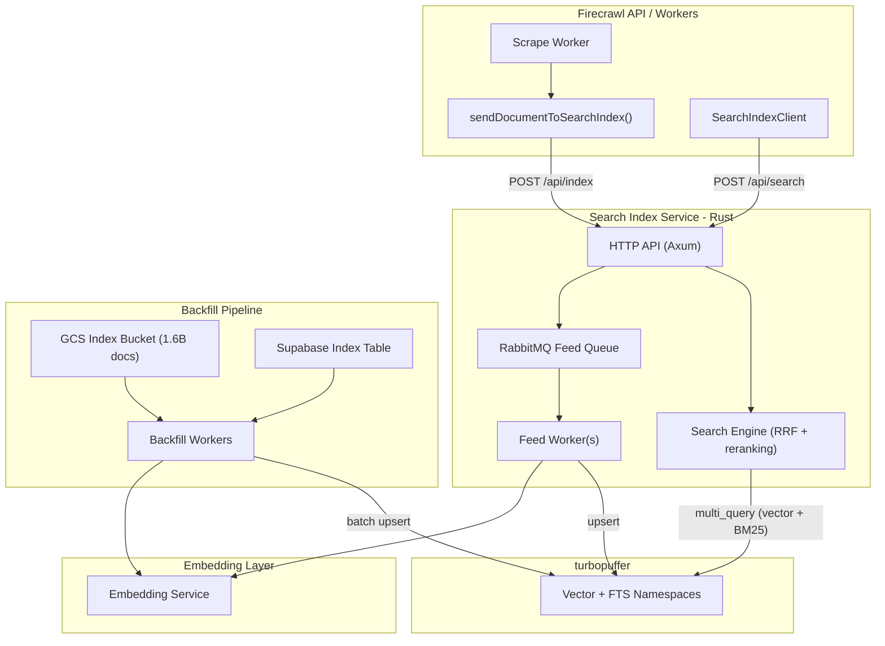

# Build a Web-Scale Search Index for Firecrawl

## Existing Data Assets

You have a significant head start:

- **1.6 billion documents** in the GCS index bucket (`GCS_INDEX_BUCKET_NAME`), each stored as `{indexId}.json` containing raw HTML, status code, content type, screenshot URL, and PDF metadata
- **50-100M fresh documents** (< 7 days old) as the high-value subset to seed first
- **Supabase index table** with metadata per document: URL, normalized URL, title (60 chars), description (160 chars), domain hashes, URL split hashes, timestamps, feature flags
- **GCS job bucket** (`GCS_BUCKET_NAME`) with full Document objects that include pre-computed **markdown** (avoids re-converting from HTML)
- **go-html-to-md** service already running (5 replicas in GKE) for HTML-to-markdown conversion
- **Ingestion pipeline** already wired: `[sendDocumentToSearchIndex.ts](apps/api/src/scraper/scrapeURL/transformers/sendToSearchIndex.ts)` transformer and `[SearchIndexClient](apps/api/src/lib/search-index-client.ts)` HTTP client
- **No embeddings** stored anywhere -- these must be generated during backfill
- **No BigQuery** data pipeline exists (config is in Helm values but no implementation)

---

## Revised Architecture: turbopuffer + Thin Service

After evaluating turbopuffer in detail, the recommendation is to use it as the vector + FTS retrieval layer instead of self-hosting Vespa. Here's why:

### Why turbopuffer fits this use case

- **Proven at scale**: 2.5T+ documents in production, 100B+ vectors queried at 200ms p99 ([ANN v3 blog](https://turbopuffer.com/blog/ann-v3)). Your 1.6B documents is well within their sweet spot.
- **Native hybrid search**: Built-in BM25 full-text search + vector search in a single system, with `multi_query` API for running both in parallel and fusing results in your code
- **Serverless / zero ops**: No StatefulSets, no content nodes, no config servers. turbopuffer manages all storage on object storage (S3/GCS) with SSD caching. Eliminates the ~12-24 content node Vespa cluster.
- **Cost**: Usage-based pricing on storage + writes + queries. At 1.6B docs with 384-dim vectors, storage is roughly ~~4.5TB. turbopuffer's pricing calculator shows this is significantly cheaper than running a 12-24 node Vespa cluster on `c4d-standard-32-lssd` machines (~~$15-30K/mo in GKE compute alone).
- **Write model works for search index**: Writes take up to 200ms to commit (object storage WAL), but documents are visible to queries faster than eventually consistent engines. For a search index that processes tens of thousands of updates/sec, this is fine.
- **Multi-namespace**: Can shard by domain, language, or content type for natural data partitioning and cost optimization
- **BYOC available**: Enterprise plan supports running in your own cloud (GCP) with private networking

### What turbopuffer does NOT do (and what you build)

- **No built-in ranking beyond BM25 + vector similarity**: You do rank fusion (RRF) and re-ranking in your service code. turbopuffer explicitly recommends this pattern ("keep search logic in `search.py`").
- **No built-in embedding**: You generate embeddings before upserting. This is standard.
- **No crawl scheduling**: You build the URL frontier and crawl scheduler.
- **No quality signals computation**: You compute domain authority, freshness, content quality externally and store as attributes.

This is actually a better separation of concerns than Vespa, where ranking logic is entangled with the storage engine.

### Architecture




---

## Detailed Build Plan

### Phase 1: Core Infrastructure + Fresh Data (Weeks 1-4)

#### 1. Search Index Service (Rust, `search-index` repo)

Rust service (Axum) matching the existing `[SearchIndexClient](apps/api/src/lib/search-index-client.ts)` contract:

**Endpoints (matching existing interface):**

- `POST /api/index` -- Receive document, publish to RabbitMQ feed queue
- `POST /api/search` -- Execute hybrid search against turbopuffer, fuse results, return
- `GET /api/stats` -- Index statistics from turbopuffer
- `GET /health` -- Health check

**Search execution logic:**

```rust
// Pseudocode for hybrid search
async fn search(req: SearchRequest) -> SearchResponse {
    let query_embedding = embed(&req.query).await;

    // turbopuffer multi_query: run vector + BM25 in parallel
    let results = tpuf.multi_query(namespace, vec![
        Query::vector("embedding", "ANN", query_embedding, top_k=100),
        Query::bm25("content", &req.query, top_k=100),
    ]).await;

    let vector_results = &results[0];
    let bm25_results = &results[1];

    // Reciprocal Rank Fusion
    let fused = reciprocal_rank_fusion(vec![vector_results, bm25_results], k=60);

    // Apply freshness decay + quality score boost
    let ranked = apply_signals(fused, |doc| {
        0.6 * doc.rrf_score
        + 0.2 * freshness_decay(doc.indexed_at)
        + 0.2 * doc.quality_score
    });

    ranked.take(req.limit)
}
```

#### 2. turbopuffer Schema

One namespace per shard (start with a single namespace, shard later if needed):

```python
# Document schema for turbopuffer
ns.write(
    upsert_rows=[{
        'id': content_hash,          # SHA-256 of URL for dedup
        'vector': embedding,          # 384-dim from embedding model
        'url': url,
        'resolved_url': resolved_url,
        'domain': domain,
        'title': title,
        'description': description,
        'content': markdown_excerpt,  # First ~2000 chars, BM25-indexed
        'language': language,
        'quality_score': 0.0,         # Updated later
        'freshness_ts': timestamp,
        'gcs_path': index_id,
        'indexed_at': now,
    }],
    distance_metric="cosine_distance",
    schema={
        "content": {"type": "string", "full_text_search": True},
        "domain": {"type": "string"},
        "language": {"type": "string"},
        "quality_score": {"type": "number"},
        "freshness_ts": {"type": "number"},
    }
)
```

Key design choices:

- **384-dim bfloat16 vectors**: Using OpenAI `text-embedding-3-small` with Matryoshka truncation to 384d. 8x less storage than 1536d with minimal quality loss for search.
- `**content` field with BM25**: turbopuffer's native full-text search, no external engine needed
- `**content_hash` as ID**: SHA-256 of normalized URL for natural deduplication on upsert
- **Attributes for filtering**: domain, language, quality_score, freshness_ts all filterable

#### 3. Ingestion Pipeline

```
Document arrives (POST /api/index from sendDocumentToSearchIndex transformer)
    |
    v
RabbitMQ feed queue (durable)
    |
    v
Feed Worker (N replicas)
    |-- 1. Check content_hash for dedup (turbopuffer upsert handles this natively)
    |-- 2. Extract markdown excerpt (~2000 chars, title + description + first content)
    |-- 3. Generate 384-dim embedding via OpenAI API (batch when possible)
    |-- 4. Upsert to turbopuffer namespace
    v
turbopuffer (document searchable within ~200ms)
```

#### 4. Backfill Fresh Documents (50-100M)

This is where the existing index pays off. The backfill pipeline:

```
Step 1: Query Supabase index table
    - Filter: created_at > NOW() - INTERVAL '7 days'
    - Get: id (indexId), url, title, description, status, domain hashes
    - Paginate using UUIDv7 ordering (built into your partition scheme)
    - Estimated: 50-100M rows

Step 2: For each batch of documents (1000 at a time):
    a. Fetch {indexId}.json from GCS index bucket -> get raw HTML
    b. Convert HTML to markdown via go-html-to-md service (already running, 5 replicas)
    c. Extract first ~2000 chars of markdown as content
    d. Generate embeddings (batch of 1000 -> OpenAI batch API)
    e. Upsert batch to turbopuffer

Step 3: Track progress in Redis (last processed indexId)
```

**Cost estimate for 100M fresh documents:**

- Embedding: 100M docs x avg 500 tokens = 50B tokens. OpenAI `text-embedding-3-small` = $0.02/1M tokens = **~$1,000**
- HTML-to-markdown conversion: Free (existing go-html-to-md service)
- turbopuffer writes: 100M docs x ~3KB each = ~300GB of writes
- turbopuffer storage: 100M docs x 384d x 2 bytes (vectors) + ~2KB attributes = ~275GB
- **Backfill time**: At 10K upserts/sec throughput, ~3 hours for 100M docs (embedding is the bottleneck, not turbopuffer)

#### 5. Embedding Model

Start with **OpenAI `text-embedding-3-small`** (1536d, truncated to 384d via Matryoshka):

- $0.02 per 1M tokens
- Supports batching (up to 2048 inputs per request)
- Use the Batch API for backfill (50% cost reduction = $0.01/1M tokens)
- For live ingestion, use the standard API (~10ms latency per batch)

Migrate to self-hosted later if cost becomes a concern at full 1.6B scale.

### Phase 2: Full Corpus + Quality (Weeks 3-8)

#### 6. Backfill Remaining 1.5B Documents

Same pipeline as Phase 1 fresh backfill, but larger:

**Cost estimate for 1.5B documents:**

- Embedding (OpenAI Batch API at $0.01/1M tokens): 1.5B x 500 tokens = 750B tokens = **~$7,500**
- turbopuffer storage: ~4TB (vectors + attributes)
- turbopuffer writes: ~4.5TB
- **Backfill time**: At 10K upserts/sec (embedding-bottlenecked), ~42 hours continuous. Parallelizable with multiple workers.

**Optimization**: Prioritize by recency. Process most recent documents first so the index is immediately useful while the long tail backfills in the background.

**Alternative optimization**: For the 1.5B older documents, check the GCS job bucket first. If a Document JSON exists with pre-computed markdown, skip the HTML-to-markdown conversion step entirely. This saves significant compute on the go-html-to-md service.

#### 7. Quality Scoring Pipeline

Compute quality signals and update as turbopuffer attributes (partial updates):

- **Domain authority**: Build from the existing indexer's link graph (the Rust indexer service already processes `index.jobs.links` with discovered URLs). Compute a simplified PageRank per domain.
- **Content quality**: Heuristic signals computed during ingestion -- word count, content-to-boilerplate ratio, reading level. Store as `quality_score` attribute.
- **Freshness decay**: Computed at query time in the search service using `freshness_ts` attribute. Exponential decay: `e^(-lambda * age_days)`.
- **Click signals**: Long-term. Feed back engagement data from search API usage.

#### 8. API Integration

Changes to Firecrawl API (minimal, since the interface is already defined):

- In `[execute.ts](apps/api/src/search/execute.ts)`: Add search index as a provider. When `SEARCH_SERVICE_URL` is set, query the search index first. Fall back to Fire Engine/SearXNG for queries where index coverage is low.
- Bump `SEARCH_INDEX_SAMPLE_RATE` from `0.1` to `1.0` in `[sendToSearchIndex.ts](apps/api/src/scraper/scrapeURL/transformers/sendToSearchIndex.ts)` -- index everything going forward.
- Add a coverage check: if the search index returns < N results, supplement with external SERP results.

### Phase 3: Scale + Proactive Crawling (Weeks 6-12)

#### 9. Namespace Sharding (if needed)

turbopuffer's per-namespace limit is 500M docs / 2TB. At 1.6B docs you'll need ~4 namespaces. Options:

- Shard by **domain hash modulo N** (simple, even distribution)
- Shard by **language** (en, es, fr, etc.) for natural partitioning
- Shard by **content type** (news, docs, forums, etc.)

The search service broadcasts queries to all shards and merges results (same pattern as Vespa distributed search or turbopuffer's ANN v3 multi-namespace approach).

#### 10. URL Frontier / Proactive Crawling

Stop just indexing what users scrape -- proactively discover and crawl the web:

- Seed from: existing 1.6B URLs in index, sitemaps, link extraction from crawls
- Priority queue: score URLs by domain authority + freshness need + popularity
- Dispatch to existing Firecrawl NUQ scrape queue
- Re-crawl policy: track `freshness_ts` per URL, re-crawl when stale

#### 11. Re-ranking Layer (Optional Enhancement)

For higher quality results, add a second-stage re-ranker after turbopuffer retrieval:

- Use Cohere Rerank, MixedBread, or a self-hosted cross-encoder
- turbopuffer returns top 100 candidates, re-ranker scores top 10-20
- Adds ~50-100ms latency but significantly improves relevance

---

## Cost Comparison

### Option A: turbopuffer (recommended)


| Component                             | Monthly Cost                |
| ------------------------------------- | --------------------------- |
| turbopuffer storage (1.6B docs, ~4TB) | ~$2,000-4,000 (usage-based) |
| turbopuffer queries (estimate 10M/mo) | ~$500-1,000                 |
| turbopuffer writes (live ingestion)   | ~$200-500                   |
| Search service (2-4 Rust pods in GKE) | ~$500                       |
| Embedding (OpenAI, live ingestion)    | ~$500-1,000                 |
| **Total**                             | **~$4,000-7,000/mo**        |


One-time backfill cost: ~$8,500 (embeddings for 1.6B docs)

### Option B: Self-hosted Vespa


| Component                                   | Monthly Cost           |
| ------------------------------------------- | ---------------------- |
| 3 config servers (2 vCPU, 8GB)              | ~$300                  |
| 6 container nodes (8 vCPU, 32GB)            | ~$3,000                |
| 18 content nodes (32 vCPU, 128GB, 1TB NVMe) | ~$18,000               |
| RabbitMQ (3 replicas)                       | ~$500                  |
| Search service pods                         | ~$500                  |
| Embedding (OpenAI or GPU)                   | ~$500-1,000            |
| Engineering ops overhead                    | Significant            |
| **Total**                                   | **~$23,000-24,000/mo** |


**turbopuffer is ~3-5x cheaper** and eliminates all infrastructure ops for the search/storage layer. The tradeoff is less control over ranking internals, but turbopuffer's philosophy of doing ranking in your own code is actually more flexible for iteration.

---

## Timeline


| Week | Milestone                                                                                  |
| ---- | ------------------------------------------------------------------------------------------ |
| 1-2  | Scaffold Rust service, set up turbopuffer account, define schema, build ingestion pipeline |
| 2-3  | Build backfill pipeline, start seeding 50-100M fresh docs from GCS index                   |
| 3-4  | Implement hybrid search (multi_query + RRF), wire into Firecrawl /v2/search                |
| 4-6  | Begin full 1.6B backfill (runs in background), build quality scoring                       |
| 6-8  | Namespace sharding, ranking tuning, observability                                          |
| 8-12 | URL frontier, proactive crawling, re-ranking layer                                         |


**Weeks 1-4 gets you a working search engine over 100M documents.**
**Weeks 4-8 scales to 1.6B.**
**Weeks 8-12 adds proactive crawling and advanced ranking.**

---

## Key Decisions Before Starting

1. **turbopuffer vs Vespa**: turbopuffer recommended for cost and ops simplicity. Talk to their sales team about enterprise pricing for your volume -- BYOC on GCP may get better latency.
2. **Embedding model**: Start with OpenAI `text-embedding-3-small` at 384d. Migrate to self-hosted if cost exceeds ~$2K/mo ongoing.
3. **Backfill priority**: Fresh documents first (50-100M), then backfill by recency. The index is useful from day 1 with just the fresh corpus.
4. **Service language**: Rust (consistent with existing indexer, handles high-throughput query + feed workloads well, good turbopuffer client support).
5. **Sharding strategy**: Start with a single namespace for the first 100M docs. Add sharding when approaching the 500M namespace limit.

